**PRAKTIKUM 10**
**Praktikum – Bagian 1: Configure the routes**

* Buat project baru yang berisi komponen posts (praktikum http service), form-member (soal uts), navbar, not-found, home
* Jika node_modules belum tersida, install menggunakan npm install
* Buka file app.module.ts. Pastikan komponen pada langkah 1 sudah terdaftar seperti gambar dibawah ini

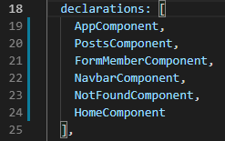

* Tambahkan module router pada halaman app.module.ts seperti gambar dibawah ini:

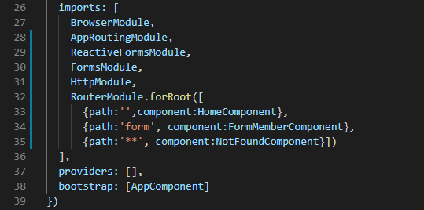

* Buka halaman navbar.component.html dan tambahkan kode dibawah ini:

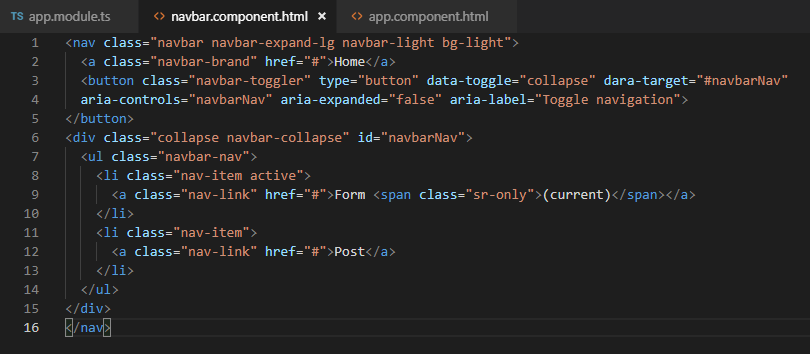

* Buka halaman app.component.html. tambahkan kode dibawah ini:

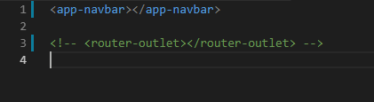

* Jalankan dan catat hasilnya (soal no. 1)

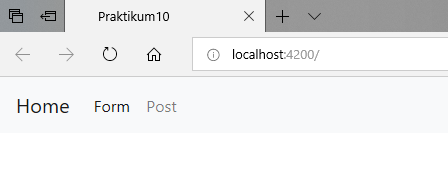

**Praktikum - Bagian 2 : Router Outlet**

* Buka halaman app.component.html dan rubah menjadi seperti dibawah ini:
 
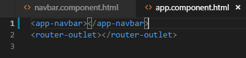

* Jalankan dan inspect elemen seperti pada gambar dibawah ini

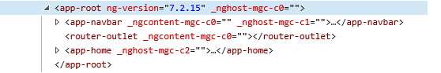

* Apa yang bisa anda simpulkan? (Soal No 2)
* Jalankan link dibawah ini localhost:4200/form seperti gambar dibawah ini: 
* catat hasilnya (Soaln No. 3)
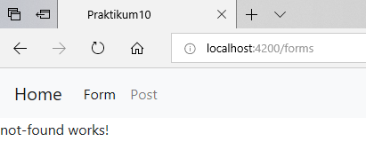

* Jalankan link dibawah ini localhost:4200/post seperti gambar dibawah ini:
* catat hasilnya (Soaln No. 4)

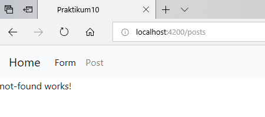

* Jalankan link dibawah ini localhost:4200/coba seperti gambar dibawah ini:
* catat hasilnya (Soaln No. 5)

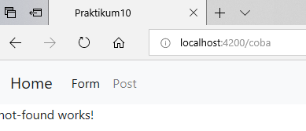

* Simpulkan langkah 3, 4 dan 5 (Soal No. 6)
* Jawab : Langkah ini berhasil di jalankan sesuai perintah, namun hasilnya sama.

**Praktikum - Bagian 3 : Add Link**

* Buka halaman navbar.component.html. tambahkan link pada href tiap menu seperti gambar dibawah ini:
 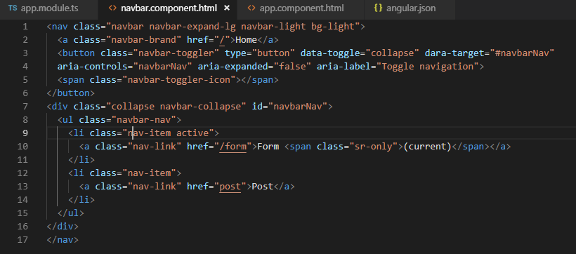

* Jalankan, catat dan berikan penjelasan (Soal No. 7)
 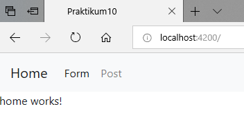

* Modifikasi href menjadi routerLink pada halaman navbar.component.html seperti gambar dibawah ini:
 
 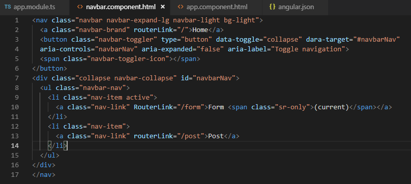

* Jalankan, inspect element, coba link dan cek pada tab network. Catat dan beri penjelasan (Soal No. 8) 

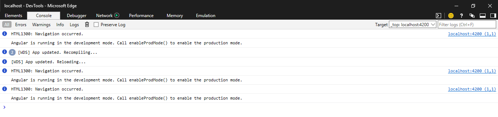

* Modifikasi class li pada halaman navbar.component.html menjadi seperti pada gambar dibawah ini:

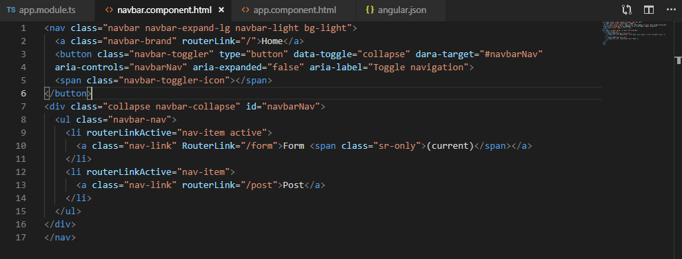

* Jalankan, catat dan beri penjelasan (Soal No. 9)
 
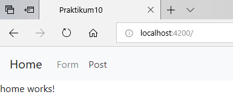

**Praktikum - Bagian 4 : Accesing Route Parameter**

* Buat komponen baru dengan nama profile dengan perintah ng g c profile
 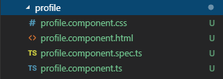

* Buka app.module.ts dan tambahkan route untuk profile seperti gambar dibawah ini:
 
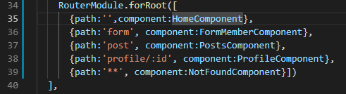

* Modifikasi halaman home.component.html menjadi seperti gambar dibawah ini:
 
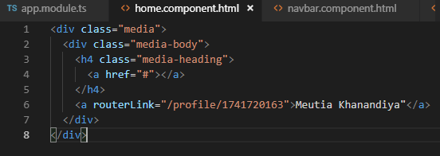

* Modifikasi file profile.component.ts menjadi seperti pada gambar dibawah ini:
 
 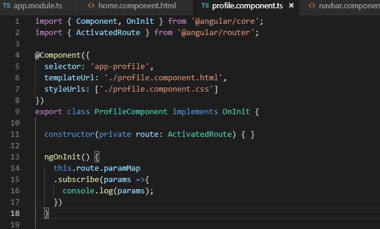

* Jalankan, klik tombol home kemudian kliklink Meutia Khanandiya kemudia inspect element seperti dibawah ini:
 
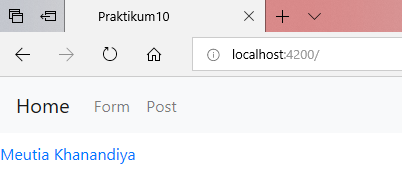

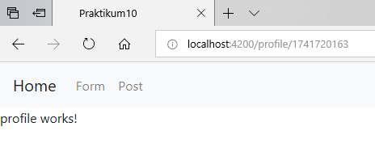

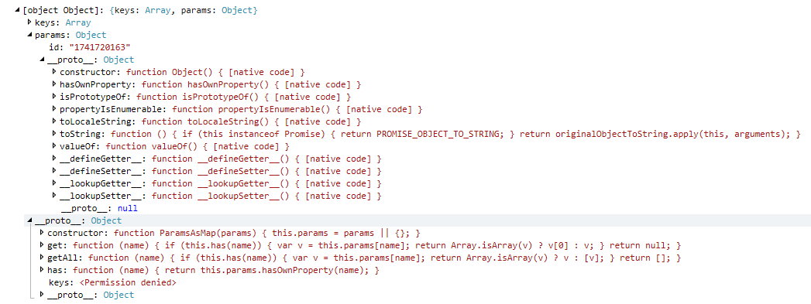

* Modifikasi file profile.component.ts menjadi seperti pada gambar dibawah ini:
 
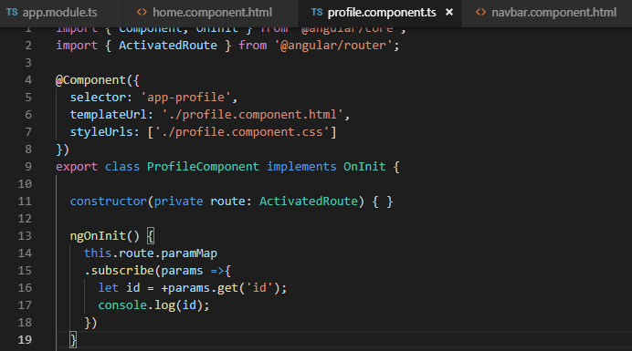

* Jalankan, klik tombol home kemudian klik link Meutia Khanandiya kemudia inspect element. Catat dan berikan penjelasan (Soaln No. 11)
 
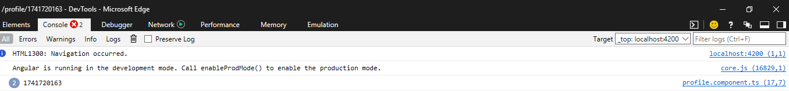

