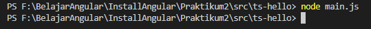

**PRAKTIKUM 2**

**--Typescript--**

**Praktikum	– Bagian 1 : Instalasi Typescript**

* Ketik perintah berikut : npm install –g typescript : 

* Kemudian cek version dari typescript yang terinstall :

* Siswa membuat direktori baru dengan nama ts-hello dengan perintah : mkdir ts-hello

* Siswa Menulis code di bawah ini :

* Kemudian buka terminal dan lakukan perintah	: tsc main.ts untuk	melakukan proses transpile file	typescript	kedalam	javascript

* Cek apakah sudah terbuat file main.js,lakukan perintah ls

* NOMOR 13 Hasilnya beda

* lakukan execute pada file main.js dengan perintah node main.js. (soal 5)	

**Praktikum – Bagian 2: Declaring Variables File main.ts**

* Membuka file main.ts , kemudian tuliskan code seperti berikut:	

* Remove file main.js hasil praktikum bagian 1 dengan perintah rm main.js, cek apakah sudah terhapus atau belum.(soal 6)	

* Siswa melakukan transpile file main.ts dengan perintah yang ada pada praktikum bagian 1 langkah no 10. Catat hasilnya apakah sudah terbuat file javascriptnya. (soal 7)

* Jika sudah terbuat, execute file javascript yang sudah terbuat pada langkah 3. Kemudian catat hasilnya (soal 8)

**Praktikum - Bagian 3: Types**

* Buka file main.ts kemudian tuliskan listing program berikut :

* Mari	kita perhatikan code pada langkah 1, terlihat bahwa terjadi error pada line 2. Namun dengan kita melakukan transpile file typescript ke dalam file javascript, kesalahan tersebut akan dibenarkan dengan sendirinya pada file javascript. 
Lakukan proses transpile file main.ts dengan perintah tsc main.ts. Catat hasilnya (soal 9)

* Kemudian buka file main.js, hasilnya harusnya seperti	berikut	:

**Praktikum – Bagian 4: Type Assertion**

* Buka file main.ts, kemudian ketikkan code berikut ini :

* Kemudian buat file main.js (jangan lupa untuk meremove file main.js sebelumnya) 
kemudian execute seperti praktikum sebelumnya. Catat hasilnya (soal 10)

**Praktikum – Bagian 5: Arrow Function**	

* Buka file main.ts, kemudian ketikkan code berikut ini :

* Kemudian buat file main.js (jangan lupa untuk meremove file main.js sebelumnya) kemudian execute seperti praktikum sebelumnya. Catat hasilnya (soal 11)

**Praktikum – Bagian 6: Interface**

* Buka file main.ts, kemudian ketikkan code berikut ini :	

* Kemudian buat file main.js (jangan lupa untuk meremove file main.js sebelumnya) kemudian execute seperti praktikum sebelumnya. Catat hasilnya (soal 12)

**Praktikum – Bagian 7: Classes**

* Buka file main.ts, kemudian ketikkan code berikut ini :

* Kemudian buat file main.js (jangan lupa untuk meremove file main.js sebelumnya) kemudian execute seperti praktikum sebelumnya. Catat hasilnya (soal	13)

**Praktikum – Bagian 8 : Objects**

* Buka file main.ts, kemudian ketik code berikut :

* Buat file main.js (jangan lupa untuk meremove file main.js sebelumnya) kemudian execute seperti praktikum sebelumnya

