**PRAKTIKUM3**

**--Angular Fundamental--**

**Praktikum – Bagian 1: Component Basic**

* Buatlah sebuah componen dengan nama courses dengan cara ng generate component name atau ng g c name
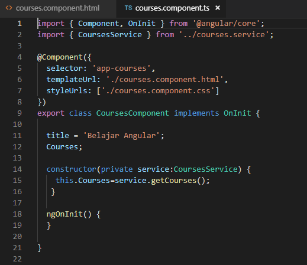

* Catat	hasilnya (soal 1)	
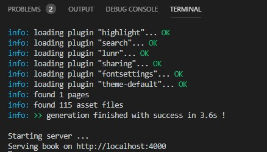

* Buka	file app.component.html, lakukan modifikasi code nya menjadi seperti berikut :
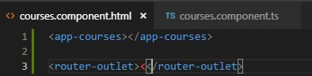	

* Kemudian open terminal dan jalan kan	perintah ng serve , lalu perhatikan pada browser.	
Catat hasilnya (soal 2)	
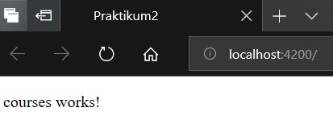	

* Buka file app.modules.ts dan	hapus coursecomponent pada declarations

```typescript
import { BrowserModule } from '@angular/platform-browser';
import { NgModule } from '@angular/core';

import { AppRoutingModule } from './app-routing.module';
import { AppComponent } from './app.component';
import { CoursesComponent } from './courses/courses.component';

@NgModule({
  declarations: [
    AppComponent,
    //CoursesComponent
  ],
  imports: [
    BrowserModule,
    AppRoutingModule
  ],
  providers: [],
  bootstrap: [AppComponent]
})
export class AppModule { }
```

* Kemudian perhatikan hasilnya pada browser. Catat hasil nya	(soal 3)	

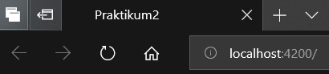

* Kemudian	lakukan	inspect	pada halaman localhost	: 4200	di	browser, apa yang terlihat?	Berikan	penjelasan	(soal	4) 
JAWAB : Lakukan inspect pada halaman. Terdapat error setelag Go to Definition , app-course merupakan elemen yang tidak diketahui.

**Praktikum	– Bagian 2 : Templates**

* Buka file courses.component.ts tambahkan property baru dengan nama title

``` typescript
import { Component, OnInit } from '@angular/core';
import { CoursesService } from '../courses.service';

@Component({
  selector: 'app-courses',
  templateUrl: './courses.component.html',
  styleUrls: ['./courses.component.css']
})
export class CoursesComponent implements OnInit {

  title = 'Belajar Angular';

    constructor() { }

  ngOnInit() {
  }
}
```

* Kemudian buka browser localhost : 4200. Catat hasilnya (soal	5)
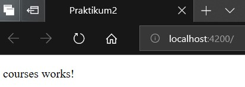

* Tambahkan string pada binding data. Buka file courses.component.html. tambahkan seperti berikut: 

```typescript
<p>
  courses works!
</p>
<p>
  {{"judulnya:" + title}}
</p>
```

* Perhatikan dan catat hasil yang ditampilkan oleh browser (soal 6)
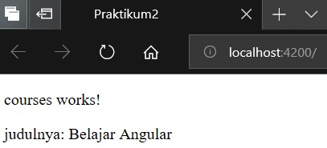

* Buka file courses.component.ts dan buatlah sebuah method dengan nama GetTitle seperti berikut ini :

```typescript
import { Component, OnInit } from '@angular/core';
import { CoursesService } from '../courses.service';

@Component({
  selector: 'app-courses',
  templateUrl: './courses.component.html',
  styleUrls: ['./courses.component.css']
})
export class CoursesComponent implements OnInit {

  title = 'Belajar Angular';
  getTitle(){
    return this.title;
  }
  
  constructor() { }

  ngOnInit() {
  }
}
```

* Buka file courses.component.html, lakukan modifikasi seperti berikut:


* Perhatikan dan catat hasil yang ditampilkan pada browser (soal 7)
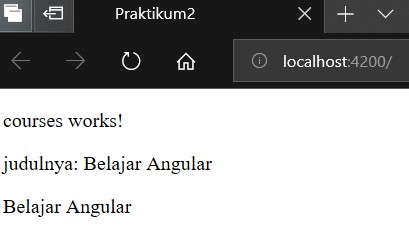

**Praktikum - Bagian 3: Directive**

* Buka file courses.component.ts dan buat properti dengan nama course dengan data berupa array

``` typescript
import { Component, OnInit } from '@angular/core';
import { CoursesService } from '../courses.service';

@Component({
  selector: 'app-courses',
  templateUrl: './courses.component.html',
  styleUrls: ['./courses.component.css']
})
export class CoursesComponent implements OnInit {

  title = 'Belajar Angular';
  Courses = [
    {id: 0, name:'HTML'},
    {id: 1, name:'PHP'},
    {id: 2, name:'ANGULAR'},
    {id: 3, name:'C#'},
    {id: 4, name:'VB.NET'},
  ]
  getTitle(){
    return this.title;
  }
  
  constructor() { }

  ngOnInit() {
  }
}
```

* Buka file courses.component.html tambahkan directive ngFor dan string interpolation seperti berikut: 

```typescript
<p>
    {{title}}
  </p>
  <table>
    <thead>
      <th>
        #ID
      </th>
      <th>Course name</th>
    </thead>
  <tbody>
    <tr *ngFor="let Course of Courses">
      <!-- string interpolation -->
      <td>{{ Course.id}} </td>
      <td>{{ Course.name }}</td>
      </tr>
  </tbody>
</table>
```

* Perhatikan	dan	catat	hasil	yang	ditampilkan	pada	browser (soal	8)	
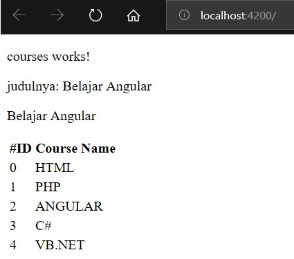

**Praktikum – Bagian 4: Services dan Dependency Injection**

* Buka file courses.service.ts kemudian tambahkan method getCourse seperti berikut:

```typescript
import { Injectable } from '@angular/core';

@Injectable({
  providedIn: 'root'
})
export class CoursesService {

  constructor() { }

  getCourses() {
    return [
    {id: 0, name:'HTML'},
    {id: 1, name:'PHP'},
    {id: 2, name:'ANGULAR'},
    {id: 3, name:'C#'},
    {id: 4, name:'VB.NET'},
    ];
  }
}
```

* Buka file courses.component.ts, kemudikan lakukan modifikasi codenya seperti berikut:

```typescript
import { Component, OnInit } from '@angular/core';
import { CoursesService } from '../courses.service';

@Component({
  selector: 'app-courses',
  templateUrl: './courses.component.html',
  styleUrls: ['./courses.component.css']
})
export class CoursesComponent implements OnInit {

  title = 'Belajar Angular';
  Courses;
  
  constructor() { }

  ngOnInit() {
  }
}
```

* Perhatikan dan catat hasil yang ditampilkan pada browser (soal 10)
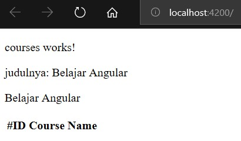

* Tambahkan constructor pada file courses.component.ts seperti berikut: 

```typescript
import { Component, OnInit } from '@angular/core';
import { CoursesService } from '../courses.service';

@Component({
  selector: 'app-courses',
  templateUrl: './courses.component.html',
  styleUrls: ['./courses.component.css']
})
export class CoursesComponent implements OnInit {

  title = 'Belajar Angular';
  Courses;

  constructor(private service:CoursesService) {
    this.Courses=service.getCourses();
  }

  ngOnInit() {
  }
}
```

* Perhatikan dan catat hasil yang ditampilkan pada browser (soal 11)
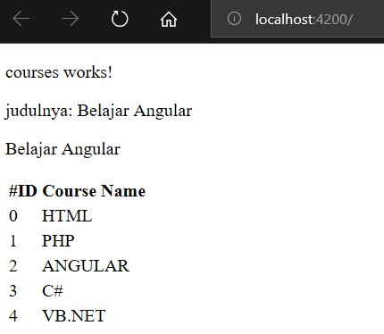		


		