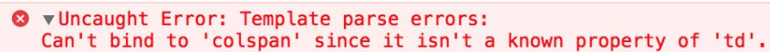

**JOBSHEET 4**

**--Displaying Data And Handling Events--**

**Praktikum – Bagian 1: Component Basic**

*Buka file course.component.ts tambahkan code berikut ini :
```typescript
import { Component, OnInit } from '@angular/core';
import { CoursesService } from '../courses.service';

@Component({
  selector: 'app-courses',
  templateUrl: './courses.component.html',
  styleUrls: ['./courses.component.css']
})
export class CoursesComponent implements OnInit {

  Title = 'Belajar Angular';
  Courses;

  binding = 'property-binding';
  imageUrl = 'http://lorempixel.com/400/200';

  constructor(private service:CoursesService) { 
    this.Courses = service.getCourses;
  }

  ngOnInit() {
  }

}
```

*Buka file course.component.html tambahkan code berikut ini :

```typescript
<p>
  {{ Title }}
</p>
<table>
  <thead>
    <th>
      #ID
    </th>
    <th>Course name</th>
  </thead>
  <tbody>
    <tr *ngFor = "let Course of Courses">
    <td>{{ Course.id }}</td>
    <td>{{ Course.name }}</td>
    </tr>
  </tbody>
</table>

<h2>{{ binding }}</h2>
<h2 [textContent]='binding'></h2>


```

* Buka localhost lalu catat hasil nya (soal 1)

**Praktikum – Bagian 2: Attribute Binding**

* Buka file courses.component.ts tambahkan properti colspan dibawah line imageUrl

```typescript
 binding = 'property-binding';
  imageUrl = 'http://lorempixel.com/400/200';
  colSpan = 2;
```

* Buka file courses.component.html dan tambahkan berikut ini :
```typescript
<table>
  <tr>
    <td [colspan]='colSpan'></td>
  </tr>
</table>
```

* Buka browser kemudian lakukan inspect maka akan muncul error seperti berikut :

*menyatakan bahwa tidak dapat binding colspan dan colspan bukan merupakan property td

* Tambahkan attr pada colspan seperti berikut :

```typescript
<table>
  <tr>
    <td [attr.colspan]='colSpan'></td>
  </tr>
</table>
```

* Selanjutnya tambahkan button pada courses.component.html seperti berikut :
```typescript
<table>
  <tr>
    <td [attr.colspan]='colSpan'></td>
  </tr>
  <button type='button' class="btn btn-primary">tambah</button>
</table>
```

* Perhatikan dan catat hasil yang ditampilkan pada browser (soal 3)

**Praktikum - Bagian 3: Class Binding**

* Buka file courses.component.ts dan tambahkan property isActive = true setelah line colspan = 2;

```typescript
  binding = 'property-binding';
  imageUrl = 'http://lorempixel.com/400/200';
  colSpan = 2;
  isActive = true;
```

* Buka file courses.component.html lalu tambahkan class binding seperti berikut :
```typescript
<table>
  <tr>
    <td [attr.colspan]='colSpan'></td>
  </tr>
  <button type='button' class="btn btn-primary">tambah</button>
</table>
```

**Bagian 4: Style Binding**

* Buka file courses.component.html lalu tambahkan class binding seperti berikut :
```typecript
<table>
  <tr>
    <td [attr.colspan]='colSpan'></td>
  </tr>
  <button type='button' class="btn btn-primary">tambah</button>
</table>

<button type="button" class="btn btn-primary" [class.active]="isActive">Tambah</button>

<button type="button" class="btn btn-primary" [style.backgroundColor]="isActive?'blue':'white'">Style</button>
<br>
```

* Hasil setelah di execute

**Bagian 5: Event Binding**

* Buka file course.component.ts dan buatlah method dengan nama onSave()
```typescript
<button type="button" class="btn btn-default" (click)="onSave()">Button</button>
```

* Hasil jika di klik maka pada console akan muncul keterangan 

* Buka file courses.component.ts tambahkan parameter $event

```typescript
onSave($event) {
    console.log("button sudah diklik",$event)
  }
```

* Tambahkan juga pada courses.component.html

```typescript
<button type="button" class="btn btn-danger" (click)="onSave($event)">Button</button>
```

* Maka hasilnya akan menampilkan pointerEvent 

* Buatlah method onDivClick() pada file courses.component.ts

```typescript
onDivClick($event) {
    console.log("ini method div",$event)
  }
```

* Tambahkan div dan event binding pada div elemen pada file courses.component.html

```typescript
<div (click)="onDivClick($event)">
  <button type="button" class="btn btn-danger"
  (click)="onSave($event)">Button</button>
</div>
```

* Hasil : apabila Button sudah diklik juga akan muncul karena tidak ada pemberhentian button

* Untuk mengatasi event bubbling maka tambahkan $event.stopPropagation pada courses.component.ts

```typescript
 onSave($event) {
    $event.stopPropagation();
    console.log("button sudah diklik",$event)
  }
```

* Jalankan localhost dan lakukan inspect elemen. Lihat pada console apa yang terjadi? Catat hasilnya dan jelaskan. (soal 7)

**Praktikum – Bagian 6: Event Filtering**

* Buat inputan pada courses.component.html

```typescript
<input type="text" (keyup.enter)="onKeyUp()">
```

* Tambahkan method onKeyUp

```typescript
  onKeyUp() {
    console.log("enter was pressed");
  }
```

*Jalankan localhost, kemudian isikan sesuatu pada kolom inputan yang sudah dibuat dan lakukan inspect elemen. 
Perhatikan pada console, Catat apa yang terjadi. (soal 8)

*Kemudian bandingkan apabila button enter ditekan maka apa yang terjadi ? (soal 9)

*HASIL = APABILA SUDAH DI ENTER

**Praktikum – Bagian 7: Template Variable**

* Tambahkan variabel #nama pada courses.component.html

```typescript
<input type="text" #nama (keyup.enter)="onKeyUp(nama.value)">
```

* Tambahkan parameter nama pada method onKeyUp

```typescipt
onKeyUp(nama) {
      console.log(nama);
    }
```

* Perhatikan apa yang terjadi ketika kita beri inputan? 
Cek pada inspect element dan lihat di console. Catat dan jelaskan. (soal 10)

**Praktikum – Bagian 8: Two Way Binding**

* Buat property baru dengan nama kalian masing-masing dan rubah parameter pada log

```typescript
 binding = 'property-binding';
  imageUrl = 'http://lorempixel.com/400/200';
  colSpan = 2;
  isActive = true;
  nama = 'meutia khanandiya';
```

* Tambahkan parameter nama pada method onKeyUp

```typescript
<input type="text" [value]="nama" (keyup.enter)="nama = $event.target.value;onKeyUp()">
```

*Perhatikan apa yang terjadi pada kolom inputan? Cek pada inspect element dan lihat di console. Catat dan jelaskan. (soal 11)

* Buka app.module.ts dan tambahkan formmodule seperti berikut :

```typescript
imports: [
    BrowserModule,
    AppRoutingModule,
    FormsModule
  ],
```

* Buka file course.component.html, modifikasi code nya seperti berikut :

```typescript
<input type="text" [(ngModel)] = "nama" (keyup.enter)="onKeyUp()">
```

* Perhatikan apa yang terjadi pada kolom inputan? Cek pada inspect element dan lihat di console. Catat dan jelaskan. (soal 12)