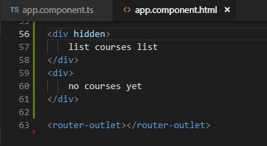
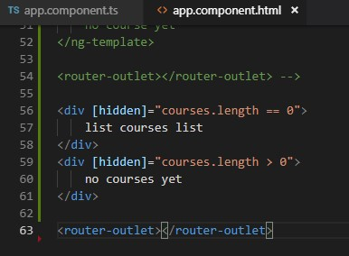
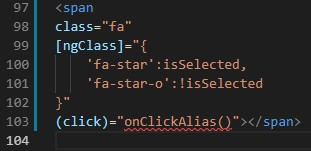
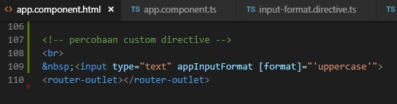

**JOBSHEET 5**

**--Directive--**

**6.1 ngIf**

* Directive ngIf digunakan untuk sebuah kondisi percabangan. Berikut contoh penggunaan ngIf.

* Buka File

* Buka File

* Jalankan localhost maka hasilnya seperti berikut

* Jika array pada app.component.ts (courses=[];) dikosongkan maka hasilnya seperti berikut

* Contoh kedua  menggunakan else: 
* Buka file app.component.html modifikasi kodenya menjadi berikut

* Jalankan localhost dengan kondisi array pada app.component  
o dengan array kosong

* Hasilnya :

* Cara Ketiga : 
* Buka file app.component.html modifikasi kodenya menjadi berikut

* Jalankan localhost dengan kondisi array pada app.component  
o dengan array kosong

* Hasilnya :

* O dengan array ada isi

**6.1 Hidden Property**

* Buka app.component.html

* Jalankan localhost maka hasilnya seperti berikut

* Selain contoh diatas kita juga dapat memberikan property seperti berikut

* Dengan catatan pada app.component.ts pada courses terdapat array courses dengan nilai 1 dan 2

* Jalankan localhost (berbeda hasil jika pada array courses tidak terdapat isinya)

* Jika kita inspect element maka akan terlihat property hidden tidak terdapat kondisi true ataupun false.

* Berbeda jika kita menggunakan ngIF terdapat bindings dengan nilai false

**6.1 ngSwitchCase**
* Buka file app.component.html modifikasi codenya menjadi seperti berikut

* Buka file app.component.ts tambahkan property viewMode (line 12)

* Menambahkan source pada angular.json

* Run localhost maka hasilnya seperti berikut saat diklik list view maka akan muncul list view content dan jika kita pilih ListView maka akan tampil tulisan List View Content

**6.1 ngFor**

* Buka app.component.ts property CoursesFor yang berisikan array (line 12)

* Buka file app.component.html tambahkan directive ngFor pada element li  

* Jika dijalankan maka hasilnya seperti berikut

* Kita juga dapat memberi tanda tertentu pada index yang bernilai ganjil dengan menggunakan isEven https://angular.io/api/common/NgForOf  

* Hasilnya

**6.1 ngFor dan change Detection**

* Pada percobaan ini kita akan menambahkan sebuah data array pada coursesFor 
* Tambahkan button pada app.component.html (line 64) 

* Tambahkan method onAdd()

* Sehingga hasilnya seperti berikut (jika kita tekan button add maka akan ditambahkan sebuah data courses 6)

 

* Setelah kita berhasil menambahkan sebuah data array pada courseFor maka untuk selanjutnya kita akan mencoba untuk melakukan penghapusan data.
* Tambahkan sebuah method onRemove pada app.component.ts

* Buka app.component.html dan tambahkan sebuah button untuk menghapus (line69)

* Hasilnya seperti berikut (pada saat button remove diclick maka salah satu data akan hilang sementara)

* Selain itu kita juga dapat melakukan perubahan status menggunakan event click  
* Buka file app.component.html tambahkan button (line 70)

* Buka file app.component.ts buatlah sebuah method onChange dengan parameter item dan didalam method tersebut adanya perubahan string menjadi updated

* Hasilnya

 

**6.1 ngFor dan trackby**

* Buka file app.component.ts buatlah sebuah method dengan nama loadCourses (line 38) tapi sebelumnya buat sebuah property dengan nama coursesForOne (line 37)

* Buka file app.component.html dan tambahkan code seperti pada gambar

* Hasilnya saat button diclick

 

* Sekarang kita lakukan analisa buka inspect element, saat button belum diclick seperti pada gambar berikut

* Dan saat button diklik maka element ul akan muncul seperti pada gambar berikut

* Oleh karena itu kita membutuhkan TrackBy yang nanti digunakan untuk mengecek jika data sudah ada maka button tidak perlu melakukan actionnya kembali
* Untuk menambahkan TrackBy dengan cara menambahkan pada app.component.html pada directive ngFor

* Selain itu tambahkan juga sebuah method trackCourse dengan parameter index dan itemone pada app.component.ts

**6.1 The leading Asterik**

* Leading asterik adalah tanda asterisk yang ada pada directive seperti *ngFor dsb. adapun maksud leading asterisk pada sebuah directive adalah bahwa kita memberi tahu angular untuk menulis ulang markup tertentu, seperti code berikut  

* Pada gambar diatas terdapat sebuah directive *ngIF dimana fungsi dari asterisk pada ngIf adalah memberi tahu angular untuk menulis ulang markup dari div tersebut menggunakan ng template dengan menggunakan property binding  seperti  pada gambar berikut

**6.1 ngClass**

* Jika pada percobaan sebelumnya kita membuat component favorite menggunakan 2 class binding yaitu class binding fa-star dan fa-star-o seperti pada gambar berikut

* Selain menggunakan class binding seperti diatas kita juga dapat menggunakan attribute directive class seperti berikut

**6.1 Custom Directive**

* Pertama kita harus membuat directive dengan nama input-format terlebih dahulu dengan perintah seperti berikut

* Jika directive berhasil digenerate maka kita pastikan di app.module.ts pada @NgModule terdapat nama directive yang kita buat tadi

* Buka input-format.directive.ts dan tambahkan decorator HostListener seperti pada gambar berikut

* Buka file app.component.html dan tambahakn code berikut

* Buka file input-format.directive.ts dan modifikasi codenya menjadi berikut

* Buka file app.component.html dan tambahkan property binding dengan nama format

* Buka file input-format.directive.ts tambahkan decorator input dan modifikasi codenya seperti pada gambar berikut

* Cat:format disini adalah kondisi di app.component.html

* Buka app.component.hml modifikasi codenya menjadi berikut

* Buka input-format.directive.ts dan tambahkan decorator input dengan parameter appInputFormat

* Jika dijalankan sebagai contoh kita memasukkan kalimat dengan huruf kecil dan pada saat kita tab maka akan berubah menjadi huruf besar semua seperti berikut

