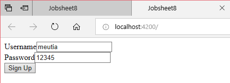

**JOBSHEET 8**

**--Reactive Form--**

**Praktikum – Bagian 1: Building a Bootstrap Form**

* Buat component baru dengan nama signup-form dengan perintah ng g c signup-form

* Modifikasi app.component.html menjadi seperti berikut:

* Modifikasi file signup-form.component.html menjadi seperti berikut:

* Jalankan dan Catat hasilnya (soal 1)

**Praktikum – Bagian 2: Control Programmatically**

* Modifikasi file signup-form.component.ts seperti dibawah ini:

* Modifikasi signup-form.component.html menjadi seperti berikut:

* Jalankan dan Catat hasil inspect elemen pada bagian console (soal 2), Akan muncul eror seperti berikut:

* Modifikasi file app.module.ts tambahkan kode berikut:

* Jalankan dan Catat hasilnya di bagian console pada browser (soal 3)

**Praktikum - Bagian 3: Adding Validation**

* Modifikasi signup-form.component.ts menjadi seperti berikut:

* Modifikasi signup-form.component.html menjadi seperti berikut:

* Jalankan, apakah validasi formnya berfungsi dan Catat hasilnya (soal 4)

* Tambahkan get username pada file signup-form.component.ts seperti berikut:

* Modifikasi file signup-form.component.html menjadi seperti berikut:

* Jalankan dan Catat hasilnya (soal 5)

**Praktikum - Bagian 4: Specific Validation Errors**

* Modifikasi signup-form.component.ts menjadi seperti berikut:

* Modifikasi signup-form.component.html menjadi seperti berikut:

* Jalankan dan Catat hasilnya (soal 6)

 

* Modifikasi signup-form.component.html menjadi seperti berikut:

* Jalankan dan Catat hasilnya (soal 7)

**Praktikum - Bagian 5: Custome Validation**

* Buat file baru pada folder signup-form dengan nama username.validators.ts dan isi dengan script sebagai berikut:

* Modifikasi signup-form.component.ts menjadi seperti berikut:

* Modifikasi signup-form.component.html menjadi seperti berikut:

* Jalankan dan Catat hasilnya (soal 8)

**Praktikum - Bagian 6: Asyncronus Validation**

* Modifikas file username.validators.ts seperti berikut:

* Modifikasi signup-form.component.ts menjadi seperti berikut:

* Modifikasi signup-form.component.html, tambahkan 
 seperti berikut:

* Jalankan dan Catat hasilnya (soal 9)

**Praktikum - Bagian 7: Displaying a Loader Image**

* Modifikasi signup-form.component.html, tambahkan 
 seperti berikut:

* Jalankan dan Catat hasilnya (soal 10)

**Praktikum - Bagian 8: Validating Form on Submit**

* Modifikasi signup-form.component.ts, dengan menambahkan method login() seperti berikut:

* Modifikasi signup-form.component.html seperti berikut:

* Jalankan dan Catat hasilnya (soal 11)

